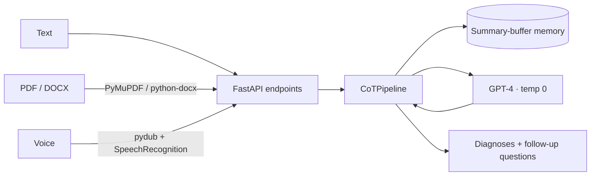

# 🩺 NurseAI

> An agentic clinical-triage assistant that reasons through a differential diagnosis the way a clinician does — one question at a time.

<p>
  
  
  
  
</p>

> ⚠️ **Disclaimer — research prototype.** NurseAI is an educational demo of LLM-based clinical reasoning. It is **not a medical device** and must **not** be used for real diagnosis or treatment. Always consult a qualified healthcare professional.

---

## Overview

NurseAI takes a patient's described symptoms — typed, spoken, or uploaded as a document — and runs them through a **chain-of-thought differential-diagnosis loop**. Instead of returning one black-box answer, it proposes candidate diagnoses across departments, then asks the most informative **follow-up questions** to rule conditions in or out, narrowing toward a confident conclusion over a multi-turn conversation.

The whole thing is served as a small FastAPI web app with a single chat-style UI.

## Features

- **Multimodal symptom intake** — three ways in, one reasoning core:
  - 📝 **Text** chat
  - 📄 **Documents** — `.pdf` (PyMuPDF) and `.docx` (python-docx) are parsed to text
  - 🎙️ **Voice** — audio is normalized with `pydub` and transcribed via `SpeechRecognition` (Google)
- **Chain-of-thought differential diagnosis** — GPT-4 (temperature 0) reasons step by step across multiple departments before committing.
- **Adaptive follow-up & rule-out loop** — the model asks targeted questions, then prunes the candidate list from the answers.
- **Token-bounded conversation memory** — `ConversationSummaryBufferMemory` summarizes older turns while keeping recent messages verbatim, so long sessions stay coherent without blowing the context window.

## How it works



Every input route (`/process_text`, `/process_document`, `/process_voice`) converts its input to text and calls `CoTPipeline.generate_diagnosis()`. The pipeline injects the running conversation summary into a step-by-step prompt, queries GPT-4, and saves the exchange back to memory.

## Tech stack

| Layer | Tools |
|---|---|
| Web / API | FastAPI, Jinja2, Uvicorn |
| LLM orchestration | LangChain, OpenAI GPT-4 |
| Memory | `ConversationSummaryBufferMemory` |
| Document parsing | PyMuPDF (`fitz`), python-docx |
| Speech-to-text | pydub, SpeechRecognition |

## Project structure

```
src/
├── app.py              # FastAPI app: routes for text, document, and voice input
├── pipelines/
│   └── CoT.py          # CoTPipeline — GPT-4 chain-of-thought + summary memory
├── models/
│   └── base_llm.py     # GPT-4 client factory
├── config.py           # Loads OPENAI_API_KEY from .env
├── templates/index.html
└── static/home.css
medAI.yml               # Conda environment
```

## Getting started

```bash
# 1. Create the environment
conda env create -f medAI.yml
conda activate medAI        # (env name as defined in medAI.yml)

# 2. Add your OpenAI key
echo "OPENAI_API_KEY=sk-..." > .env

# 3. Run the app (from the repo root, so templates/ and static/ resolve)
uvicorn src.app:app --reload
```

Then open `http://127.0.0.1:8000` and describe symptoms by text, upload, or microphone.

## API endpoints

| Method | Route | Input | Purpose |
|---|---|---|---|
| `GET`  | `/`                 | — | Chat UI |
| `POST` | `/process_text`     | form field `query` | Diagnose from typed symptoms |
| `POST` | `/process_document` | `.pdf` / `.docx` file | Diagnose from an uploaded report |
| `POST` | `/process_voice`    | audio file | Transcribe, then diagnose |

## Limitations & future work

- Educational prototype — **not** clinically validated.
- Voice transcription depends on the Google Web Speech API (network required).
- Diagnosis quality is bounded by the prompt and base model; no retrieval over medical literature yet.
- **Roadmap ideas:** ground answers in a medical knowledge base (RAG), add structured symptom intake, swap the Google recognizer for a local Whisper model, and add evaluation against vignette datasets.
